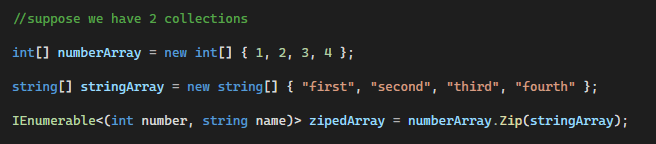
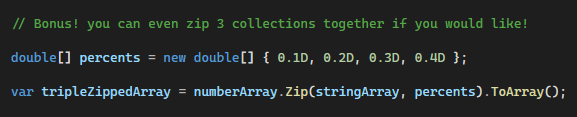
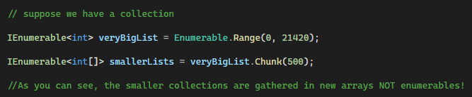
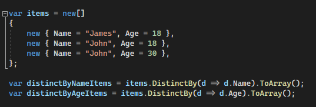
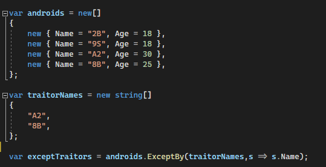
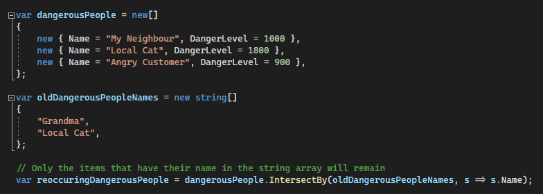
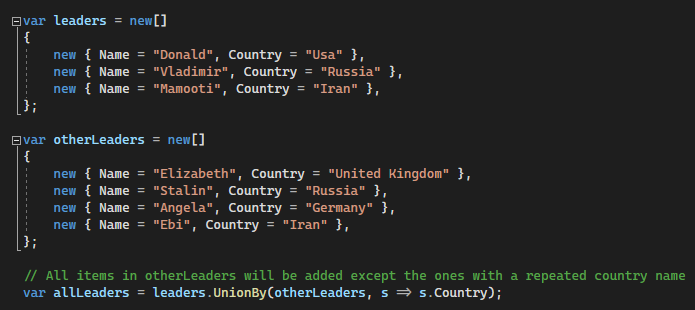
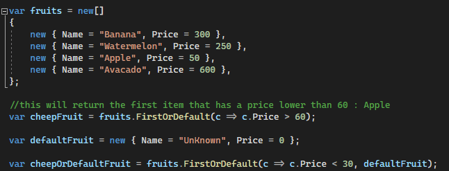
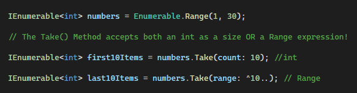
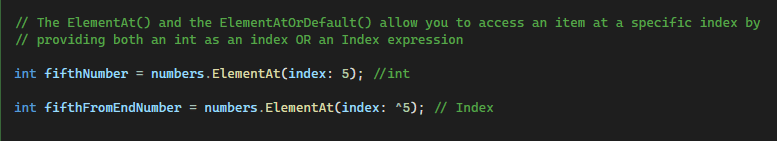

# .Net 6 Linq
Showcasing some new Linq Apis in .NET 6!

Here we will take a look at some of the new provided Linq apis which were introduced in .NET 6.

Table of Content:
1) Zip()
2) Chunk()
3) \*By()
4) \*OrDefault()

# #1: Zip()

	Used to join the vlaues of 2 collection together in a tuple.

	You can even use it for up to 3 collections!
	

# #2: Chunk()

	Used to split collections into specific sized smaller collections.
	

# #3: New *By() Methods

1- DistinctBy()

	Used to filter the items in a collection by specifying a sub-value to be used for comparison.
	

2- ExceptBy()

	Used to filter a collection by comparing a sub-value of the items to values
	provided by another collection of values which are of the same type
	and removing the matching elements.
	

3- IntersectBy()

	Used to filter a collection by comparing a sub-value of the items to values
	provided by another collection of values which are of the same type
	and removing the *non matching* elements.

4- UnionBy()

	Used to Create a union of two collections by specifiying a sub-value of the 
	items to be used as the unique comparison key.
	

# #4: *OrDefault() improvement

	By default, all the *OrDefault() Extension Methods return default(T) when they fail
	to find the requested item. with the new version, you can specify a default
	value to be returned instead of default(T).
	

# #5: Index and Range operations on IEnumerable

	You can now use the Index and Range Expressions on new provided Methods for IEnumerable<T>

1- Take()

	This Method accepts both an integer and a Range expression for enumerating the 
	IEnumerable and giving you the result.

		
2- ElementAt() - ElementAtOrDefault()

	These Methods now accept both an interger and an Index expression for enumerating the
	IEnumerable and finding the requested item at that location.
	

by:
[Sepehr golpazir](https://www.linkedin.com/in/sepehr-golpazir-161559197/)
